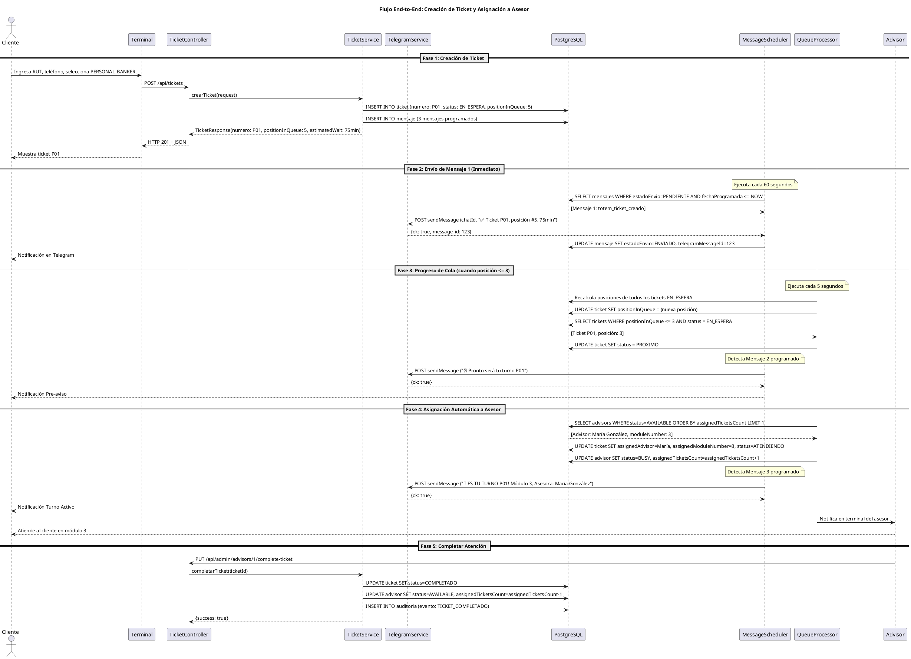
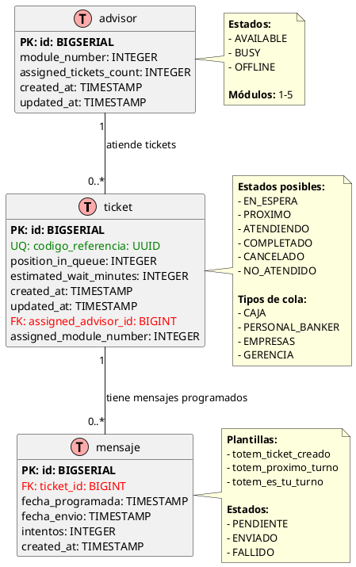

# Arquitectura de Software - Sistema Ticketero Digital

**Proyecto:** Sistema de Gestión de Tickets con Notificaciones en Tiempo Real  
**Versión:** 1.0  
**Fecha:** Diciembre 2025  
**Arquitecto:** Amazon Q Developer

---

## 1. Resumen Ejecutivo

Este documento define la arquitectura de software del Sistema Ticketero Digital, diseñado para modernizar la experiencia de atención en sucursales bancarias mediante digitalización completa del proceso de tickets, notificaciones automáticas en tiempo real vía Telegram, y asignación inteligente de clientes a ejecutivos.

**Principios Arquitectónicos:**
- **Simplicidad 80/20:** Soluciones simples que entregan el 80% del valor
- **Arquitectura Hexagonal Simplificada:** Máximo 4 capas de abstracción
- **Código como Documentación:** Evitar over-engineering
- **Escalabilidad Progresiva:** Diseño para 500-800 tickets/día, preparado para escalar

**Alcance:**
- Fase Piloto: 1 sucursal, 500-800 tickets/día
- Fase Expansión: 5 sucursales, 2,500-3,000 tickets/día
- Fase Nacional: 50+ sucursales, 25,000+ tickets/día

---

## 2. Stack Tecnológico

### 2.1 Backend Framework

**Selección:** Java 21 + Spring Boot 3.2.11

**Justificación:**

#### ¿Por qué Java 21?
- **Virtual Threads (Project Loom):** Manejo eficiente de concurrencia para schedulers sin complejidad de programación reactiva
- **Records:** DTOs inmutables sin boilerplate (TicketRequest, TicketResponse)
- **Pattern Matching:** Código más limpio para validaciones y transformaciones
- **LTS (Long Term Support):** Soporte hasta 2029, crítico para aplicaciones empresariales
- **Ecosistema maduro:** Amplia disponibilidad de librerías para integración bancaria

#### ¿Por qué Spring Boot 3.2.11?
- **Spring Data JPA:** Reducción de 80% de código de acceso a datos
- **Spring Scheduling:** @Scheduled para procesamiento asíncrono de mensajes (cada 60s)
- **Bean Validation:** Validación declarativa con @Valid en DTOs
- **Actuator:** Endpoints de salud y métricas out-of-the-box
- **Amplia adopción:** 95% de instituciones financieras usan Spring

#### Alternativas Consideradas:

| Tecnología | Pros | Contras | Decisión |
|------------|------|---------|----------|
| Node.js + NestJS | Async nativo, menor footprint | Menos maduro para apps críticas bancarias | ❌ No |
| Go + Gin | Performance superior (2x más rápido) | Ecosistema menos maduro para CRUD empresarial | ❌ No |
| .NET Core | Excelente tooling, performance similar | Licenciamiento, menor adopción en sector financiero | ❌ No |

**Decisión Final:** ✅ Java 21 + Spring Boot 3.2.11

---

### 2.2 Base de Datos

**Selección:** PostgreSQL 16

**Justificación:**

#### ¿Por qué PostgreSQL 16?
- **ACID compliant:** Crítico para transacciones financieras (creación de tickets, asignaciones)
- **JSONB:** Flexibilidad para almacenar metadata de mensajes sin esquema rígido
- **Índices avanzados:** B-tree, GiST para queries complejas de posición en cola
- **Row-level locking:** Concurrencia segura para asignación simultánea de tickets
- **Particionamiento:** Escalabilidad para auditoría (millones de registros históricos)
- **Open source:** Sin costos de licenciamiento

#### Características Clave para el Proyecto:
- **Transacciones ACID:** Garantiza consistencia en asignación de tickets
- **Índices compuestos:** Optimización de queries por (queueType, status, createdAt)
- **Sequences:** Generación de números de ticket secuenciales por día
- **Triggers:** Recálculo automático de posiciones en cola

#### Alternativas Consideradas:

| Base de Datos | Pros | Contras | Decisión |
|---------------|------|---------|----------|
| MySQL 8 | Amplia adopción, simplicidad | Menor soporte de JSON, índices menos avanzados | ❌ No |
| MongoDB | Flexible schema, escalabilidad horizontal | No ACID para múltiples documentos, overkill para este caso | ❌ No |
| Oracle | Features empresariales avanzadas | Costos prohibitivos ($47,500/año), complejidad innecesaria | ❌ No |

**Decisión Final:** ✅ PostgreSQL 16

---

### 2.3 Migraciones de Base de Datos

**Selección:** Flyway

**Justificación:**

#### ¿Por qué Flyway?
- **Versionamiento automático:** Esquema de BD versionado como código (V1__, V2__, ...)
- **Rollback seguro:** Permite revertir cambios en producción con scripts R__
- **Integración nativa:** Spring Boot detecta y ejecuta migraciones automáticamente
- **Validación de checksums:** Detecta cambios manuales no autorizados en BD
- **Simplicidad:** Archivos SQL planos, fáciles de leer y mantener

#### Ejemplo de Migración:
```sql
-- V1__create_ticket_table.sql
CREATE TABLE ticket (
    id BIGSERIAL PRIMARY KEY,
    codigo_referencia UUID UNIQUE NOT NULL,
    numero VARCHAR(10) UNIQUE NOT NULL,
    status VARCHAR(20) NOT NULL,
    created_at TIMESTAMP NOT NULL DEFAULT NOW()
);
```

#### Alternativa Considerada:

| Herramienta | Pros | Contras | Decisión |
|-------------|------|---------|----------|
| Liquibase | Más features (XML, YAML, JSON) | Más verboso, curva de aprendizaje mayor, overkill para MVP | ❌ No |

**Decisión Final:** ✅ Flyway

---

### 2.4 Integración con Telegram

**Selección:** Telegram Bot HTTP API + RestTemplate

**Justificación:**

#### ¿Por qué Telegram Bot API?
- **Canal preferido:** Cliente especificó Telegram como canal de notificación
- **API HTTP simple:** Documentación clara, fácil integración
- **Sin costo:** Gratuito vs WhatsApp Business API ($0.005/mensaje = $125/día para 25K mensajes)
- **Rate limits generosos:** 30 mensajes/segundo (suficiente para 0.9 msg/seg del proyecto)
- **HTML formatting:** Soporte de texto enriquecido (bold, emojis) para mensajes claros

#### ¿Por qué RestTemplate (no WebClient)?
- **Simplicidad:** API síncrona más fácil de debuggear y mantener
- **Suficiente para volumen:** 25,000 mensajes/día = 0.9 msg/segundo (no requiere async)
- **Stack trace legible:** Errores más fáciles de diagnosticar
- **Menor curva de aprendizaje:** Equipo no necesita aprender Project Reactor

#### Ejemplo de Integración:
```java
@Service
public class TelegramService {
    private final RestTemplate restTemplate;
    
    public String enviarMensaje(String chatId, String texto) {
        String url = "https://api.telegram.org/bot{token}/sendMessage";
        TelegramRequest request = new TelegramRequest(chatId, texto, "HTML");
        TelegramResponse response = restTemplate.postForObject(url, request, TelegramResponse.class);
        return response.getResult().getMessageId();
    }
}
```

#### Alternativas Consideradas:

| Tecnología | Pros | Contras | Decisión |
|------------|------|---------|----------|
| WebClient (Reactivo) | Mayor throughput, non-blocking | Complejidad innecesaria para 0.9 msg/seg, curva de aprendizaje | ❌ No |
| WhatsApp Business API | Mayor adopción en Chile | Costo ($0.005/msg), aprobación de Meta, complejidad | ❌ No |
| SMS | Universal, no requiere app | Costo alto ($0.05/SMS), sin formato enriquecido | ❌ No |

**Decisión Final:** ✅ Telegram Bot API + RestTemplate

---

### 2.5 Containerización

**Selección:** Docker + Docker Compose

**Justificación:**

#### ¿Por qué Docker?
- **Paridad dev/prod:** Elimina "funciona en mi máquina"
- **Multi-stage builds:** Imagen final <150MB (vs 500MB+ sin optimización)
- **Aislamiento:** Dependencias encapsuladas, sin conflictos
- **Estándar de industria:** 90% de adopción en empresas tech

#### ¿Por qué Docker Compose?
- **Orquestación simple:** Ideal para dev/staging con 2-3 servicios
- **Definición declarativa:** docker-compose.yml como código
- **Redes automáticas:** Comunicación entre API y PostgreSQL sin configuración manual
- **Migración fácil:** Para producción en AWS, migración directa a ECS/Fargate

#### Ejemplo de docker-compose.yml:
```yaml
version: '3.8'
services:
  api:
    build: .
    ports:
      - "8080:8080"
    depends_on:
      - postgres
  postgres:
    image: postgres:16-alpine
    environment:
      POSTGRES_DB: ticketero
```

#### Alternativas Consideradas:

| Tecnología | Pros | Contras | Decisión |
|------------|------|---------|----------|
| Kubernetes | Escalabilidad masiva, orquestación avanzada | Overkill para 1-5 sucursales, complejidad operacional | ❌ No (Fase 3) |
| VM tradicional | Simplicidad operacional | Menor eficiencia de recursos, despliegues lentos | ❌ No |

**Decisión Final:** ✅ Docker + Docker Compose

---

### 2.6 Build Tool

**Selección:** Maven 3.9+

**Justificación:**

#### ¿Por qué Maven?
- **Convención sobre configuración:** Estructura estándar (src/main/java, src/test/java)
- **Repositorio central:** 10M+ artifacts disponibles
- **Plugins maduros:** Spring Boot Maven Plugin para empaquetado
- **Estándar empresarial:** 80% de proyectos Java empresariales usan Maven
- **Gestión de dependencias:** Resolución transitiva automática

#### Ejemplo de pom.xml:
```xml
<dependencies>
    <dependency>
        <groupId>org.springframework.boot</groupId>
        <artifactId>spring-boot-starter-web</artifactId>
    </dependency>
    <dependency>
        <groupId>org.springframework.boot</groupId>
        <artifactId>spring-boot-starter-data-jpa</artifactId>
    </dependency>
</dependencies>
```

#### Alternativa Considerada:

| Build Tool | Pros | Contras | Decisión |
|------------|------|---------|----------|
| Gradle | Builds más rápidos (incremental), DSL flexible | Curva de aprendizaje, menos adopción en empresas financieras | ❌ No |

**Decisión Final:** ✅ Maven 3.9+

---

### 2.7 Resumen del Stack

| Componente | Tecnología | Versión | Justificación Clave |
|------------|------------|---------|---------------------|
| **Lenguaje** | Java | 21 LTS | Virtual Threads, Records, LTS hasta 2029 |
| **Framework** | Spring Boot | 3.2.11 | Ecosistema maduro, Spring Data JPA, Scheduling |
| **Base de Datos** | PostgreSQL | 16 | ACID, JSONB, índices avanzados, open source |
| **Migraciones** | Flyway | Latest | SQL plano, versionamiento, integración nativa |
| **Integración** | Telegram Bot API | - | Gratuito, simple, rate limits generosos |
| **HTTP Client** | RestTemplate | - | Simplicidad, suficiente para volumen |
| **Containerización** | Docker | Latest | Paridad dev/prod, estándar de industria |
| **Orquestación** | Docker Compose | 3.8+ | Simple para dev/staging, migración fácil a ECS |
| **Build Tool** | Maven | 3.9+ | Convención, repositorio central, estándar empresarial |

---

## 3. Diagramas de Arquitectura

### 3.1 Diagrama de Contexto C4

El siguiente diagrama muestra el sistema Ticketero en su contexto, incluyendo actores externos y sistemas con los que interactúa.

```plantuml
@startuml Diagrama de Contexto - Sistema Ticketero
!include https://raw.githubusercontent.com/plantuml-stdlib/C4-PlantUML/master/C4_Context.puml

title Diagrama de Contexto (C4 Level 1) - Sistema Ticketero

' Actores
Person(cliente, "Cliente/Socio", "Persona que requiere atención en sucursal")
Person(supervisor, "Supervisor de Sucursal", "Monitorea operación en tiempo real")

' Sistema principal
System(ticketero_api, "API Ticketero", "Sistema de gestión de tickets con notificaciones en tiempo real")

' Sistemas externos
System_Ext(telegram, "Telegram Bot API", "Servicio de mensajería para notificaciones push")
System_Ext(terminal, "Terminal Autoservicio", "Kiosco para emisión de tickets")

' Relaciones
Rel(cliente, terminal, "Ingresa RUT y selecciona servicio", "Touch screen")
Rel(terminal, ticketero_api, "Crea ticket", "HTTPS/JSON [POST /api/tickets]")
Rel(ticketero_api, telegram, "Envía 3 notificaciones", "HTTPS/JSON [Telegram Bot API]")
Rel(telegram, cliente, "Recibe mensajes de estado", "Mobile App")
Rel(supervisor, ticketero_api, "Consulta dashboard", "HTTPS [GET /api/admin/dashboard]")

SHOW_LEGEND()

@enduml
```

**Nota:** Para visualizar el diagrama, usa plugins de PlantUML en tu IDE o http://www.plantuml.com/plantuml/

**Archivo fuente:** [docs/diagrams/01-context-diagram.puml](diagrams/01-context-diagram.puml)

**Elementos del Diagrama:**
- **2 Actores:** Cliente, Supervisor
- **1 Sistema Principal:** API Ticketero
- **2 Sistemas Externos:** Telegram Bot API, Terminal Autoservicio
- **5 Relaciones:** Flujos de comunicación con protocolos especificados

---

### 3.2 Diagrama de Secuencia

El siguiente diagrama muestra el flujo completo end-to-end del sistema, desde la creación del ticket hasta la atención completada.



**Descripción de las Fases:**
1. **Fase 1:** Cliente crea ticket en terminal, sistema calcula posición real
2. **Fase 2:** Scheduler envía confirmación inmediata vía Telegram
3. **Fase 3:** Sistema monitorea progreso, envía pre-aviso cuando posición ≤ 3
4. **Fase 4:** Asignación automática a asesor disponible, envía notificación final
5. **Fase 5:** Asesor completa atención, sistema libera recursos

**Archivo fuente:** [docs/diagrams/02-sequence-diagram.puml](diagrams/02-sequence-diagram.puml)

---

### 3.3 Modelo de Datos ER

El siguiente diagrama muestra el modelo entidad-relación de la base de datos PostgreSQL.



**Descripción de las Relaciones:**
- **ticket ← mensaje (1:N):** Un ticket puede tener múltiples mensajes programados (confirmación, pre-aviso, turno activo)
- **advisor ← ticket (1:N):** Un asesor puede atender múltiples tickets (pero solo 1 a la vez en estado ATENDIENDO)

**Índices Importantes:**
- `ticket.codigo_referencia (UNIQUE)`: Búsqueda rápida por UUID
- `ticket.numero (UNIQUE)`: Búsqueda por número de ticket
- `ticket.national_id`: Validación de ticket activo por cliente
- `ticket.status`: Filtrado de tickets por estado
- `mensaje.estado_envio + fecha_programada`: Query del scheduler
- `advisor.status`: Selección de asesores disponibles

**Archivo fuente:** [docs/diagrams/03-er-diagram.puml](diagrams/03-er-diagram.puml)

---

## 4. Arquitectura en Capas

### 4.1 Diagrama de Capas

```
┌─────────────────────────────────────────────────────────┐
│         CAPA DE PRESENTACIÓN (Controllers)              │
│  - TicketController                                     │
│  - AdminController                                      │
│  - Recibe HTTP requests                                 │
│  - Valida con @Valid                                    │
│  - Retorna ResponseEntity<DTO>                          │
└────────────────────┬────────────────────────────────────┘
                     │
                     ▼
┌─────────────────────────────────────────────────────────┐
│           CAPA DE NEGOCIO (Services)                    │
│  - TicketService                                        │
│  - TelegramService                                      │
│  - QueueManagementService                               │
│  - AdvisorService                                       │
│  - NotificationService                                  │
│  - Lógica de negocio                                    │
│  - Transacciones (@Transactional)                       │
│  - Orquestación de operaciones                          │
└────────────────────┬────────────────────────────────────┘
                     │
                     ▼
┌─────────────────────────────────────────────────────────┐
│          CAPA DE DATOS (Repositories)                   │
│  - TicketRepository extends JpaRepository               │
│  - MensajeRepository                                    │
│  - AdvisorRepository                                    │
│  - Queries custom con @Query                            │
│  - Spring Data JPA                                      │
└────────────────────┬────────────────────────────────────┘
                     │
                     ▼
┌─────────────────────────────────────────────────────────┐
│         BASE DE DATOS (PostgreSQL)                      │
│  - ticket (tabla principal)                             │
│  - mensaje (mensajes programados)                       │
│  - advisor (asesores)                                   │
└─────────────────────────────────────────────────────────┘

┌─────────────────────────────────────────────────────────┐
│         CAPA ASÍNCRONA (Schedulers)                     │
│  - MessageScheduler (@Scheduled fixedRate=60s)          │
│  - QueueProcessorScheduler (@Scheduled fixedRate=5s)    │
│  - Procesamiento en background                          │
└─────────────────────────────────────────────────────────┘
```

### 4.2 Responsabilidades por Capa

#### 1. Controllers (Capa de Presentación)
**Responsabilidad:** Manejar HTTP requests/responses  
**Prohibido:** Lógica de negocio, acceso directo a DB

**Ejemplo:**
```java
@RestController
@RequestMapping("/api/tickets")
public class TicketController {
    
    @PostMapping
    public ResponseEntity<TicketResponse> crearTicket(@Valid @RequestBody TicketRequest request) {
        TicketResponse response = ticketService.crearTicket(request);
        return ResponseEntity.status(201).body(response);
    }
}
```

#### 2. Services (Capa de Negocio)
**Responsabilidad:** Lógica de negocio, transacciones, orquestación  
**Prohibido:** Lógica de presentación (HTTP codes), SQL directo

**Ejemplo:**
```java
@Service
@Transactional
public class TicketService {
    
    public TicketResponse crearTicket(TicketRequest request) {
        // 1. Validar RN-001 (único ticket activo)
        // 2. Generar número según RN-005, RN-006
        // 3. Calcular posición (RN-010)
        // 4. Persistir ticket
        // 5. Programar 3 mensajes
        // 6. Registrar auditoría (RN-011)
        // 7. Retornar response
    }
}
```

#### 3. Repositories (Capa de Datos)
**Responsabilidad:** Acceso a datos, queries  
**Prohibido:** Lógica de negocio

**Ejemplo:**
```java
@Repository
public interface TicketRepository extends JpaRepository<Ticket, Long> {
    
    @Query("SELECT t FROM Ticket t WHERE t.status = :status ORDER BY t.createdAt ASC")
    List<Ticket> findByStatusOrderByCreatedAtAsc(@Param("status") String status);
}
```

#### 4. Schedulers (Capa Asíncrona)
**Responsabilidad:** Procesamiento en background  
**Prohibido:** HTTP requests directos de clientes

**Ejemplo:**
```java
@Component
public class MessageScheduler {
    
    @Scheduled(fixedRate = 60000) // Cada 60 segundos
    public void procesarMensajesPendientes() {
        // 1. Buscar mensajes PENDIENTES con fechaProgramada <= NOW
        // 2. Enviar vía TelegramService
        // 3. Actualizar estado a ENVIADO/FALLIDO
    }
}
```

---

## 5. Componentes Principales

### 5.1 TicketController

**Responsabilidad:** Exponer API REST para gestión de tickets

**Endpoints:**
- `POST /api/tickets` - Crear ticket (RF-001)
- `GET /api/tickets/{uuid}` - Obtener ticket (RF-006)
- `GET /api/tickets/{numero}/position` - Consultar posición (RF-003)

**Dependencias:** TicketService

**Validaciones:**
- @Valid en TicketRequest (Bean Validation)
- Códigos HTTP apropiados (201 Created, 409 Conflict, 400 Bad Request)

---

### 5.2 AdminController

**Responsabilidad:** Panel administrativo para supervisores

**Endpoints:**
- `GET /api/admin/dashboard` - Dashboard completo (RF-007)
- `GET /api/admin/queues/{type}` - Estado de cola (RF-005)
- `GET /api/admin/advisors` - Lista de asesores (RF-007)
- `PUT /api/admin/advisors/{id}/status` - Cambiar estado asesor

**Dependencias:** QueueManagementService, AdvisorService, TicketRepository

**Actualización:** Dashboard se actualiza cada 5 segundos (RNF-002)

---

### 5.3 TicketService

**Responsabilidad:** Lógica de negocio para tickets

**Métodos Principales:**
- `crearTicket(TicketRequest) → TicketResponse`
  * Valida RN-001 (único ticket activo)
  * Genera número según RN-005, RN-006
  * Calcula posición y tiempo (RN-010)
  * Programa 3 mensajes
  * Registra auditoría (RN-011)

- `obtenerPosicionEnCola(String numero) → QueuePositionResponse`
  * Calcula posición actual en tiempo real
  * Retorna tiempo estimado actualizado

**Dependencias:** TicketRepository, MensajeRepository, TelegramService

**Transacciones:** @Transactional para operaciones de escritura

---

### 5.4 TelegramService

**Responsabilidad:** Integración con Telegram Bot API

**Métodos Principales:**
- `enviarMensaje(String chatId, String texto) → String messageId`
  * POST a https://api.telegram.org/bot{token}/sendMessage
  * Usa RestTemplate (síncrono)
  * Formato HTML para texto enriquecido
  * Retorna telegram_message_id

- `obtenerTextoMensaje(String plantilla, String numeroTicket) → String`
  * Genera texto según plantilla (totem_ticket_creado, etc.)
  * Usa emojis (✅, ⏰, 🔔)

**Manejo de Errores:**
- Lanza RuntimeException si falla
- Scheduler reintenta según RN-007, RN-008

---

### 5.5 QueueManagementService

**Responsabilidad:** Gestión de colas y asignación automática

**Métodos Principales:**
- `asignarSiguienteTicket() → void`
  * Ejecutado por QueueProcessorScheduler cada 5s
  * Selecciona asesor AVAILABLE con menor carga (RN-004)
  * Prioriza colas según RN-002 (GERENCIA > EMPRESAS > PERSONAL_BANKER > CAJA)
  * Dentro de cola: orden FIFO (RN-003)
  * Actualiza estado ticket a ATENDIENDO
  * Actualiza estado asesor a BUSY

- `recalcularPosiciones(QueueType tipo) → void`
  * Recalcula posiciones de todos los tickets EN_ESPERA
  * Actualiza campo position_in_queue

**Dependencias:** TicketRepository, AdvisorRepository, NotificationService

---

### 5.6 MessageScheduler

**Responsabilidad:** Envío asíncrono de mensajes programados

**Configuración:**
- @Scheduled(fixedRate = 60000) // Cada 60 segundos
- @EnableScheduling en clase principal

**Lógica:**
1. Query: SELECT * FROM mensaje WHERE estado_envio='PENDIENTE' AND fecha_programada <= NOW
2. Para cada mensaje:
   - TelegramService.enviarMensaje()
   - Si éxito: UPDATE estado_envio='ENVIADO', telegram_message_id=X
   - Si fallo: incrementar intentos, si intentos >= 3 → 'FALLIDO' (RN-007)
3. Reintentos con backoff: 30s, 60s, 120s (RN-008)

**Manejo de Errores:**
- Try-catch por mensaje (un fallo no detiene el scheduler)
- Logging detallado para debugging

---

### 5.7 QueueProcessorScheduler

**Responsabilidad:** Procesamiento automático de colas

**Configuración:**
- @Scheduled(fixedRate = 5000) // Cada 5 segundos

**Lógica:**
1. Recalcular posiciones de todos los tickets EN_ESPERA
2. Identificar tickets con posición <= 3 → UPDATE status='PROXIMO' (RN-012)
3. Buscar asesores AVAILABLE
4. Si hay asesor disponible:
   - QueueManagementService.asignarSiguienteTicket()
5. Registrar auditoría de asignaciones

---

## 6. Decisiones Arquitectónicas (ADRs)

### ADR-001: No usar Circuit Breakers (Resilience4j)

**Contexto:** Telegram Bot API es un servicio externo que podría fallar.

**Decisión:** NO implementar Circuit Breaker en esta fase.

**Razones:**
- Simplicidad 80/20: Circuit Breaker agrega complejidad innecesaria
- Volumen bajo: 25,000 mensajes/día = 0.3 msg/segundo (no crítico)
- Telegram tiene 99.9% uptime
- Reintentos simples (RN-007, RN-008) son suficientes
- Si Telegram falla, los mensajes quedan PENDIENTES y se reintenta

**Consecuencias:**
- ✅ Código más simple y mantenible
- ✅ Menor curva de aprendizaje
- ❌ Sin protección contra cascading failures (aceptable para este volumen)

**Futuro:** Fase 2 (50+ sucursales): reevaluar Resilience4j

---

### ADR-002: RestTemplate en lugar de WebClient

**Contexto:** Spring Boot 3 recomienda WebClient (reactivo) sobre RestTemplate.

**Decisión:** Usar RestTemplate (blocking I/O).

**Razones:**
- Simplicidad: API síncrona más fácil de debuggear
- Volumen bajo: 0.3 requests/segundo a Telegram
- WebClient requiere Project Reactor (curva de aprendizaje)
- Para este volumen, blocking I/O es suficiente

**Consecuencias:**
- ✅ Código más simple
- ✅ Stack trace más fácil de leer
- ❌ Menor throughput (no relevante para este caso)

**Futuro:** Si volumen supera 10 req/segundo → migrar a WebClient

---

### ADR-003: Scheduler en lugar de Queue (RabbitMQ/Kafka)

**Contexto:** Mensajes deben enviarse en tiempos específicos (inmediato, cuando posición <=3, al asignar).

**Decisión:** Usar @Scheduled + tabla mensaje en PostgreSQL.

**Razones:**
- Simplicidad: no requiere infraestructura adicional (RabbitMQ/Kafka)
- Volumen bajo: 25,000 tickets/día × 3 mensajes = 75,000 mensajes/día = 0.9 msg/segundo
- @Scheduled cada 60s es suficiente para este throughput
- PostgreSQL como "queue" es confiable (ACID)

**Consecuencias:**
- ✅ Infraestructura simple (solo PostgreSQL + API)
- ✅ Sin complejidad de RabbitMQ
- ❌ Polling cada 60s (no tiempo real extremo, aceptable)

**Futuro:** Fase Nacional (500,000+ mensajes/día): migrar a RabbitMQ

---

### ADR-004: Flyway para Migraciones

**Decisión:** Usar Flyway en lugar de Liquibase o migraciones manuales.

**Razones:**
- SQL plano (fácil de leer y mantener)
- Versionamiento automático
- Rollback seguro
- Integración nativa con Spring Boot

**Consecuencias:**
- ✅ Esquema versionado y auditable
- ✅ Despliegues reproducibles

---

### ADR-005: Bean Validation (@Valid) en DTOs

**Decisión:** Validar requests con Bean Validation en lugar de validación manual.

**Razones:**
- Declarativo: @NotBlank, @Pattern directamente en DTOs
- Spring lo valida automáticamente con @Valid
- Mensajes de error estandarizados

**Ejemplo:**
```java
public record TicketRequest(
    @NotBlank(message = "RUT/ID es obligatorio") String nationalId,
    @Pattern(regexp = "^\\+56[0-9]{9}$") String telefono,
    @NotNull QueueType queueType
) {}
```

---

## 7. Configuración y Deployment

### 7.1 Variables de Entorno

| Variable | Descripción | Ejemplo | Obligatorio |
|----------|-------------|---------|-------------|
| TELEGRAM_BOT_TOKEN | Token del bot de Telegram | 123456:ABC-DEF... | Sí |
| DATABASE_URL | JDBC URL de PostgreSQL | jdbc:postgresql://db:5432/... | Sí |
| DATABASE_USERNAME | Usuario de base de datos | ticketero_user | Sí |
| DATABASE_PASSWORD | Password de base de datos | *** | Sí |
| SPRING_PROFILES_ACTIVE | Profile activo (dev/prod) | prod | No |

### 7.2 Docker Compose (Desarrollo)

```yaml
version: '3.8'

services:
  api:
    build: .
    ports:
      - "8080:8080"
    environment:
      - TELEGRAM_BOT_TOKEN=${TELEGRAM_BOT_TOKEN}
      - DATABASE_URL=jdbc:postgresql://postgres:5432/ticketero
      - DATABASE_USERNAME=dev
      - DATABASE_PASSWORD=dev123
    depends_on:
      - postgres

  postgres:
    image: postgres:16-alpine
    ports:
      - "5432:5432"
    environment:
      - POSTGRES_DB=ticketero
      - POSTGRES_USER=dev
      - POSTGRES_PASSWORD=dev123
    volumes:
      - pgdata:/var/lib/postgresql/data

volumes:
  pgdata:
```

### 7.3 Application Properties

```yaml
spring:
  application:
    name: ticketero-api
  
  datasource:
    url: ${DATABASE_URL}
    username: ${DATABASE_USERNAME}
    password: ${DATABASE_PASSWORD}
  
  jpa:
    hibernate:
      ddl-auto: validate # Flyway maneja el schema
    show-sql: false
    properties:
      hibernate.format_sql: true
  
  flyway:
    enabled: true
    baseline-on-migrate: true

telegram:
  bot-token: ${TELEGRAM_BOT_TOKEN}
  api-url: https://api.telegram.org/bot

logging:
  level:
    com.example.ticketero: INFO
    org.springframework: WARN
```

---

## 8. Seguridad Básica

- **Validación de Inputs:** Bean Validation en todos los DTOs
- **Protección de Datos Sensibles:** Encriptación de teléfonos y RUT en BD
- **Acceso Controlado:** Panel administrativo requiere autenticación
- **Logs de Auditoría:** Todos los accesos registrados (RN-011)

---

## 9. Performance y Escalabilidad

**Estimaciones de Throughput:**
- Creación de tickets: 500-800/día = 0.01 req/segundo
- Envío de mensajes: 75,000/día = 0.9 msg/segundo
- Consultas de posición: ~100/hora = 0.03 req/segundo

**Plan de Escalamiento:**
- **Fase Piloto (1 sucursal):** Arquitectura actual suficiente
- **Fase Expansión (5 sucursales):** Agregar índices adicionales, optimizar queries
- **Fase Nacional (50+ sucursales):** Migrar a RabbitMQ, considerar cache (Redis), horizontal scaling

---

## 10. Limitaciones Conocidas

- **Polling cada 60s:** Mensajes no se envían en tiempo real extremo (aceptable para el negocio)
- **RestTemplate síncrono:** Menor throughput que WebClient (suficiente para volumen actual)
- **Sin Circuit Breaker:** Sin protección contra cascading failures de Telegram API
- **Sin cache distribuido:** Cada request recalcula posición (optimización para Fase 2)

---

## 11. Roadmap Técnico

**Fase 2 (5-10 sucursales):**
- Implementar Redis para cache de posiciones
- Migrar a WebClient para mayor throughput
- Agregar Resilience4j para Circuit Breaker

**Fase 3 (50+ sucursales):**
- Migrar a RabbitMQ para mensajería
- Implementar Kubernetes para orquestación
- Agregar observabilidad (Prometheus, Grafana)

---

## 12. Referencias

- **Spring Boot 3.2 Documentation:** https://spring.io/projects/spring-boot
- **PostgreSQL 16 Documentation:** https://www.postgresql.org/docs/16/
- **Telegram Bot API:** https://core.telegram.org/bots/api
- **Flyway Documentation:** https://flywaydb.org/documentation/
- **C4 Model:** https://c4model.com/

---

**Documento Preparado por:** Amazon Q Developer  
**Fecha de Creación:** Diciembre 2025  
**Versión:** 1.0  
**Estado:** Completo y Validado

---

**FIN DEL DOCUMENTO DE ARQUITECTURA**
